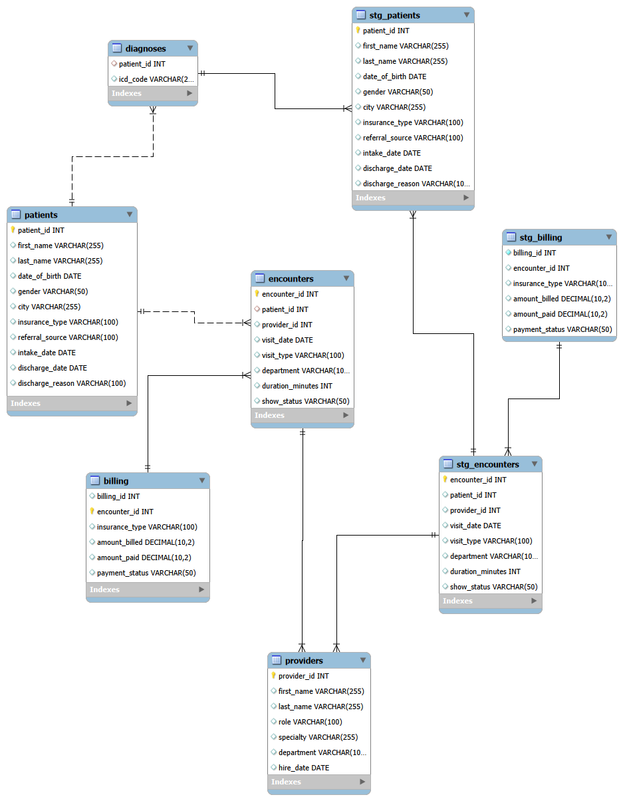

# Sunrise Behavioral Health Clinic — SQL Analytics Project

## Overview

This project presents a full end-to-end SQL analytics investigation of a behavioral health clinic's operational and financial performance from 2021 to 2024. The dataset was purpose-built to mirror the relational schema of a real behavioral health EMR system, incorporating realistic ICD-10 diagnosis coding, insurance payer mix, provider caseload structures, and clinical workflows drawn from 3 years of direct behavioral health experience.

The analysis follows the complete data analyst workflow: raw data ingestion, data quality assessment, staging layer construction, and multi-dimensional analytical querying — culminating in actionable findings for clinic leadership.

The project demonstrates production-style SQL using Common Table Expressions (CTEs), window functions, multi-table joins, data validation, staging tables, and business-focused analytical reporting.

---

## Project Snapshot

- 🏥 Behavioral Health Clinic Analytics
- 📊 5 relational tables
- 👥 150 patients
- 🩺 2,233 encounters
- 💰 2,234 billing records
- 📅 January 2021 – June 2024
- 🛠️ MySQL 8.0 & MySQL Workbench

---

## Business Problem

A behavioral health clinic experienced significant revenue and operational shifts between 2021 and 2024. Leadership needs to understand:

- What drove the revenue decline between 2022 and 2023?
- Which providers are performing efficiently, and which represent operational risk?
- Are patients being retained year-over-year, or is the clinic losing its existing base?
- What is driving patient discharges — clinical completion or external factors like insurance denial?
- Which patient populations represent the highest utilization and financial risk?

---

## Dataset

| Table | Rows | Description |
|---|---:|---|
| patients | 150 | Demographics, insurance, referral source, intake/discharge information |
| providers | 10 | Provider role, specialty, department, hire date |
| encounters | 2,233 | Individual patient visits with provider, date, type, and attendance status |
| billing | 2,234 | Billing records with amount billed, amount paid, and payment status |
| diagnoses | 300 | Patient ICD-10 diagnosis codes |

**Date Range:** January 2021 – June 2024

---

## Technologies

- MySQL 8.0
- MySQL Workbench
- Git
- GitHub

---

## Data Architecture

This project implements a two-layer architecture mirroring production analytics engineering practices.

**Raw Layer** — Source tables loaded directly from the EMR export and preserved without modification. All data quality issues are documented but never deleted.

**Staging Layer** — Cleaned and standardized tables used for all downstream analysis.

- `stg_patients` — City names standardized using `UPPER(TRIM(REPLACE()))`
- `stg_encounters` — NULL provider IDs, invalid dates, and duplicate encounters removed
- `stg_billing` — Overpaid records and orphaned billing entries removed

This approach preserves raw data for auditability while maintaining analytical accuracy. The same Raw → Staging pattern is expanded into a dbt analytics engineering workflow in Portfolio Project 3.

### Entity Relationship Diagram



---

## Data Quality Assessment

Six categories of data quality issues were identified and documented before any business analysis was performed.

| Issue | Count | Root Cause | Resolution |
|---|---:|---|---|
| NULL provider_id in encounters | 10 | Staff transition — encounters logged before provider assignment | Excluded from provider-level analysis |
| visit_date before intake_date | 5 | Data entry errors | Excluded from date-range analysis |
| Duplicate encounter records | 4 | EMR import duplication | Retained lowest encounter_id as canonical record |
| amount_paid > amount_billed | 6 | Data entry/system calculation error | Excluded from revenue analysis |
| Orphaned billing records | 5 | Partial data migration | Excluded from revenue analysis |
| Inconsistent city formatting | 20 | Manual entry inconsistencies | Standardized using `UPPER(TRIM(REPLACE()))` |

Full validation queries are available in [`sql/02_data_validation.sql`](sql/02_data_validation.sql).

---

## Key Findings

The following findings were produced using analytical SQL queries executed against the cleaned staging layer.

### 1. Clinic-wide revenue declined 26% between 2022 and 2023

Total revenue fell from **$79,637** in 2022 to **$58,818** in 2023 while encounter volume declined **17%** over the same period. Revenue during the second half of 2023 was roughly half that of the first half, suggesting an accelerating decline rather than a gradual slowdown.

### 2. Private insurance revenue experienced the largest financial decline

Although revenue decreased across every payer type, Private insurance generated the largest absolute loss (**$12,323**, or **33.1%**). Because Private insurance also produced the highest revenue per encounter, the financial impact was disproportionately large.

### 3. Insurance denial was the second leading discharge reason

Among 43 discharged patients, **23.3%** were discharged because of insurance denial, second only to treatment completion (**44.2%**). This suggests an opportunity to review medical necessity documentation and payer-specific denial trends.

### 4. Michael Okafor represents a significant operational risk

Michael Okafor recorded the highest no-show rate (**48.3%**) while generating the lowest revenue per encounter (**$47.57**). His Substance Use caseload and heavy Medi-Cal payer mix likely contribute to both operational and financial challenges.

### 5. Two providers generated nearly two-thirds of clinic revenue

David Schwartz and Elena Vasquez generated **62.6%** of all provider revenue during 2023. This level of revenue concentration represents a meaningful organizational risk if either provider were to leave.

### 6. Hospital discharge referrals demonstrated the strongest patient engagement

Hospital Discharge referrals produced the clinic's lowest no-show rate (**16.4%**), while Provider Referrals produced the highest (**28.3%**). Referral source appears to be a meaningful predictor of appointment adherence.

### 7. High-utilization patients disproportionately rely on Medi-Cal

Seventeen patients exceeded **1.5 standard deviations** above the average encounter count. Nearly half (**47%**) were covered by Medi-Cal, suggesting the clinic's most resource-intensive patients are also among its lowest reimbursing populations.

---

## Technical Skills Demonstrated

### SQL Concepts

- Multi-table JOINs (INNER and LEFT)
- Common Table Expressions (CTEs)
- Window Functions (`LAG`, `LEAD`, `RANK`, `DENSE_RANK`, `NTILE`, `SUM OVER`, `AVG OVER`)
- Conditional Aggregation
- Correlated Subqueries
- CROSS JOIN
- Date Functions
- String Manipulation
- COALESCE
- Statistical Analysis using `STDDEV()`
- Referential Integrity Validation
- Duplicate Detection
- Data Quality Assessment

### Data Engineering Concepts

- Raw → Staging architecture
- CREATE TABLE AS SELECT
- Non-destructive data cleaning
- Data quality documentation
- Reproducible analytical workflow

---

## Repository Structure

```text
sunrise-behavioral-health-analytics/
│
├── README.md
│
├── images/
│   └── schema_erd.png
│
├── data/
│   └── sunrise_behavioral_health_v4_mysql.sql
│
└── sql/
    ├── 01_staging_tables.sql
    ├── 02_data_validation.sql
    └── 03_business_analysis.sql
```

---

## How to Run

1. Install MySQL 8.0 and MySQL Workbench.
2. Create a new database:

```sql
CREATE DATABASE sunrise_bh_v4;
```

3. Run `data/sunrise_behavioral_health_v4_mysql.sql` to load the raw tables.
4. Execute `sql/01_staging_tables.sql` to build the staging layer.
5. Execute `sql/02_data_validation.sql` to reproduce the data quality assessment.
6. Execute `sql/03_business_analysis.sql` to reproduce all analytical findings.

---

## Future Work

This project serves as the foundation for two additional portfolio projects built on the same healthcare dataset.

- **Power BI Executive Dashboard** — Interactive dashboards for clinic leadership featuring operational, financial, and provider performance KPIs.
- **Python + dbt Analytics Pipeline** — Automated data ingestion, transformation, testing, and documentation using modern analytics engineering practices.

Together, these three projects demonstrate the complete analytics lifecycle—from raw data ingestion through business intelligence reporting.

---

## HIPAA Note

This project uses entirely synthetic data generated to mirror realistic behavioral health EMR structures. No real patient data was used at any point. In a production environment, all protected health information (PHI) would be replaced with de-identified patient identifiers following HIPAA Safe Harbor guidelines before any analytical work.

---

## About

Built by **Jakob Bridgman**, a behavioral health professional with three years of direct clinical experience transitioning into healthcare data analytics.

This project combines technical SQL skills with domain expertise in behavioral health operations, revenue cycle management, and clinical workflow analysis.

**Currently pursuing Healthcare Data Analyst, Business Intelligence Analyst, and Epic Clarity Analyst opportunities.**

Feel free to connect or reach out with feedback.
