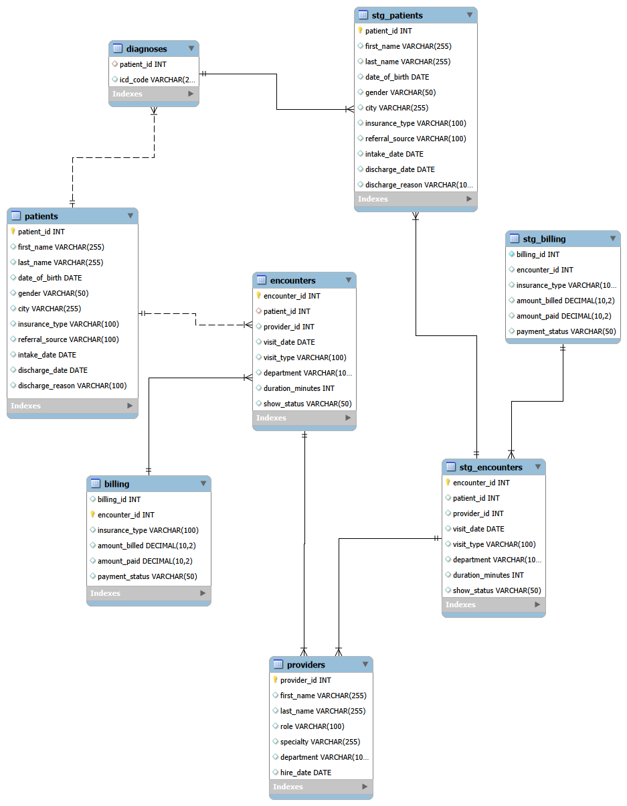

# Sunrise Behavioral Health Analytics | End-to-End SQL Data Analysis

## Executive Summary

- **Revenue fell 26% in one year**, from $79,637 in 2022 to $58,818 in 2023, while encounter volume fell 17%. The second half of 2023 brought in roughly half the revenue of the first half.
- **No-shows cost the clinic an estimated $16,250 in 2023** — 168 missed appointments at an average of $96.74 per attended visit. One provider accounts for about $8,010 of that, and bringing his no-show rate to the 20% benchmark would recover roughly $4,700 per year.
- **Private insurance revenue dropped $12,323 (33.1%)** from 2022 to 2023 — the largest loss of any payer, from the payer that reimburses the most per visit.
- **Two providers generate 52.6% of clinic revenue** ($30,946 of $58,818 in 2023). That is concentrated risk if either one leaves.

*All dollar figures come from the synthetic dataset described below. It is a scaled-down sample, so rates and per-encounter figures carry over to a real clinic better than the absolute totals do. Every figure is reproducible from the SQL files in this repo.*

---

## Overview

This project presents a full end-to-end SQL analytics investigation of a behavioral health clinic's operational and financial performance from 2021 to 2024. The dataset was purpose-built to mirror the relational schema of a real behavioral health EMR system, incorporating realistic ICD-10 diagnosis coding, insurance payer mix, provider caseload structures, and clinical workflows drawn from three years of direct behavioral health experience.

The analysis follows the complete data analyst workflow: raw data ingestion, data quality assessment, staging layer construction, and multi-dimensional analytical querying—culminating in actionable findings for clinic leadership.

The project demonstrates production-style SQL using Common Table Expressions (CTEs), window functions, multi-table joins, data validation, staging tables, and business-focused analytical reporting.

---

## Project Snapshot

- 🏥 Behavioral Health Clinic Analytics
- 📊 5 relational tables
- 👥 150 patients
- 🩺 2,233 encounters
- 💰 2,234 billing records
- 📅 January 2021 – June 2024
- 🛠️ MySQL 8.0 & MySQL Workbench

---

## Business Problem

A behavioral health clinic experienced significant revenue and operational shifts between 2021 and 2024. Leadership needs to understand:

- What drove the revenue decline between 2022 and 2023?
- Which providers are performing efficiently, and which represent operational risk?
- Are patients being retained year-over-year, or is the clinic losing its existing base?
- What is driving patient discharges—clinical completion or external factors like insurance denial?
- Which patient populations represent the highest utilization and financial risk?
- **What are these problems costing the clinic, and what is fixing them worth?**

---

## Dataset

| Table | Rows | Description |
|---|---:|---|
| patients | 150 | Demographics, insurance, referral source, intake/discharge information |
| providers | 10 | Provider role, specialty, department, hire date |
| encounters | 2,233 | Individual patient visits with provider, date, type, and attendance status |
| billing | 2,234 | Billing records with amount billed, amount paid, and payment status |
| diagnoses | 300 | Patient ICD-10 diagnosis codes |

**Date Range:** January 2021 – June 2024

---

## Technologies

- MySQL 8.0
- MySQL Workbench
- Git
- GitHub

---

## Data Architecture

This project implements a two-layer architecture that mirrors common analytics engineering practices.

**Raw Layer** — Source tables are loaded directly from the simulated EMR export and preserved without modification. Data quality issues are documented but never removed from the original source tables.

**Staging Layer** — Cleaned and standardized tables used for all downstream analysis.

- `stg_patients` — City names standardized using `UPPER(TRIM(REPLACE()))`
- `stg_encounters` — NULL provider IDs, invalid dates, and duplicate encounters removed
- `stg_billing` — Overpaid records and orphaned billing entries removed

This approach preserves the original source data for auditability while ensuring all business analysis is performed against clean, standardized staging tables. Separating raw and transformed data creates a reproducible analytical workflow while reflecting practices commonly used in modern analytics environments.

### Entity Relationship Diagram



---

## Data Quality Assessment

Six categories of data quality issues were identified and documented before any business analysis was performed.

| Issue | Count | Root Cause | Resolution |
|---|---:|---|---|
| NULL provider_id in encounters | 10 | Staff transition — encounters logged before provider assignment | Excluded from provider-level analysis |
| visit_date before intake_date | 5 | Data entry errors | Excluded from date-range analysis |
| Duplicate encounter records | 4 | EMR import duplication | Retained lowest encounter_id as canonical record |
| amount_paid > amount_billed | 6 | Data entry/system calculation error | Excluded from revenue analysis |
| Orphaned billing records | 5 | Partial data migration | Excluded from revenue analysis |
| Inconsistent city formatting | 20 | Manual entry inconsistencies | Standardized using `UPPER(TRIM(REPLACE()))` |

Full validation queries are available in [`sql/02_data_validation.sql`](sql/02_data_validation.sql).

---

## Key Findings

The following findings were produced using analytical SQL queries executed against the cleaned staging layer.

### 1. Clinic-wide revenue declined 26% between 2022 and 2023

Total revenue fell from **$79,637** in 2022 to **$58,818** in 2023 while encounter volume declined **17%** over the same period. Revenue during the second half of 2023 was roughly half that of the first half, suggesting an accelerating decline rather than a gradual slowdown.

### 2. Private insurance revenue experienced the largest financial decline

Although revenue decreased across every payer type, Private insurance generated the largest absolute loss (**$12,323**, or **33.1%**). Because Private insurance also produced the highest revenue per encounter, the financial impact was disproportionately large.

### 3. Insurance denial was the second leading discharge reason

Among 43 discharged patients, **23.3%** were discharged because of insurance denial, second only to treatment completion (**44.2%**). Denials were spread across all three payers (4 Private, 3 Medi-Cal, 3 Medicare), which points to a documentation and authorization process issue rather than a single-payer issue.

### 4. Michael Okafor represents a significant operational risk

Michael Okafor recorded the highest no-show rate in 2023 (**48.3%**) while generating the lowest revenue per encounter (**$47.57**). His 87 no-shows cost an estimated **$8,010** in 2023. His Substance Use caseload and heavy Medi-Cal payer mix likely contribute to both operational and financial challenges.

### 5. Two providers generated over half of clinic revenue

David Schwartz and Elena Vasquez generated **52.6%** of all provider revenue during 2023 (**$30,946** of **$58,818**). This level of revenue concentration represents a meaningful organizational risk if either provider were to leave.

### 6. Hospital discharge referrals demonstrated the strongest patient engagement

Hospital Discharge referrals produced the clinic's lowest no-show rate (**16.4%**), while Provider Referrals produced the highest (**28.3%**). Referral source appears to be a meaningful predictor of appointment adherence.

### 7. High-utilization patients disproportionately rely on Medi-Cal

Seventeen patients exceeded **1.5 standard deviations** above the average encounter count. Nearly half (**47%**) were covered by Medi-Cal, suggesting the clinic's most resource-intensive patients are also among its lowest reimbursing populations.

---

## Financial Impact

Each estimate assumes a prevented no-show becomes an attended visit reimbursed at the relevant average paid amount per attended encounter (2023). Revenue per attended visit is used rather than per encounter, because no-shows are billed at $0 and would understate what a kept appointment is worth.

| Opportunity | Calculation | Estimated Value |
|-------------|-------------|-----------------|
| Clinic-wide no-show cost | 168 no-shows × $96.74 | ~$16,250 lost in 2023 |
| Okafor no-shows to 20% benchmark | 51 fewer no-shows × $92.07 | ~$4,700/year recovered |
| Provider Referral no-shows to Hospital Discharge rate (16.44%) | ~20 fewer no-shows × $95.47 | ~$1,890/year recovered |
| Revenue concentration | Schwartz + Vasquez 2023 revenue | $30,946 (52.6%) at risk |

**Insurance denials are not given a dollar figure.** In this dataset, patients discharged for insurance denial had the same average visit count (13.6 vs 13.9) and length of stay (~410 days) as patients who completed treatment, so the data does not show a measurable revenue gap. Modeling denial cost properly requires claims and authorization data.

Full queries are available in [`sql/04_financial_impact.sql`](sql/04_financial_impact.sql).

---

## Technical Skills Demonstrated

### SQL Concepts

- Multi-table JOINs (INNER and LEFT)
- Common Table Expressions (CTEs)
- Window Functions (`LAG`, `LEAD`, `RANK`, `DENSE_RANK`, `NTILE`, `SUM OVER`, `AVG OVER`)
- Conditional Aggregation
- Correlated Subqueries
- CROSS JOIN
- Date Functions
- String Manipulation
- COALESCE
- Statistical Analysis using `STDDEV()`
- Referential Integrity Validation
- Duplicate Detection
- Data Quality Assessment

### Data Engineering Concepts

- Raw → Staging architecture
- CREATE TABLE AS SELECT
- Non-destructive data cleaning
- Data quality documentation
- Reproducible analytical workflow

---

## Repository Structure

```
sunrise-behavioral-health-analytics/
│
├── README.md
│
├── images/
│   └── schema_erd.png
│
├── data/
│   └── sunrise_behavioral_health_v4_mysql.sql
│
└── sql/
    ├── 01_staging_tables.sql
    ├── 02_data_validation.sql
    ├── 03_business_analysis.sql
    └── 04_financial_impact.sql
```

---

## How to Run

1. Clone this repository or download the project files.

2. Open MySQL Workbench and create a new database:

```sql
CREATE DATABASE sunrise_bh_v4;
```

3. Select the new database:

```sql
USE sunrise_bh_v4;
```

4. Execute `data/sunrise_behavioral_health_v4_mysql.sql` to create and populate the raw source tables.

5. Execute `sql/01_staging_tables.sql` to build the cleaned and standardized staging tables.

6. Execute `sql/02_data_validation.sql` to reproduce the documented data quality assessment.

7. Execute `sql/03_business_analysis.sql` to reproduce the analytical findings presented in this project.

8. Execute `sql/04_financial_impact.sql` to reproduce the financial impact estimates.

---

## Related Projects

- **[Power BI Executive Dashboard](https://github.com/bridgyjake/sunrise-behavioral-health-powerbi)** — The findings from this project visualized as an interactive 3-page dashboard for clinic leadership, connected live to these staging tables.
- **Revenue Integrity Pipeline (in progress)** — Python, PySpark, and Databricks pipeline that catches denial risk, expiring authorizations, and high-risk appointments before they cost the clinic money.

---

## HIPAA Note

This project uses entirely synthetic data generated to mirror realistic behavioral health EMR structures. No real patient data was used at any point. In a production environment, all protected health information (PHI) would be replaced with de-identified patient identifiers following HIPAA Safe Harbor guidelines before any analytical work.

The dataset is a scaled-down sample (150 patients, 10 providers, 2021–2024). Rates, ratios, and per-encounter figures reflect realistic clinic dynamics; absolute revenue totals are smaller than a real 10-provider clinic would produce.

---

## How AI Was Used

Claude (Anthropic) was used as a tutor throughout this project: generating the synthetic dataset and its intentional data quality issues, explaining SQL concepts before I drilled them, reviewing my queries, and helping structure this documentation. I wrote the analytical queries myself. The business questions and the clinical interpretation of the findings draw on my own behavioral health experience.

---

## About

Built by **Jakob Bridgman** — Microsoft Certified: Power BI Data Analyst Associate (PL-300), with 3+ years of direct clinical experience in behavioral health, transitioning into healthcare data analytics and data engineering.

This project combines SQL skills with a firsthand understanding of behavioral health operations, revenue cycle, and clinical workflows. It reflects my approach to analytics: understanding the business context first, ensuring data quality, and putting a dollar figure on what the data shows.

*Targeting Healthcare Data Analyst, Clinical Data Analyst, BI Analyst, and junior Analytics Engineering roles.*

**LinkedIn:** https://www.linkedin.com/in/jakob-bridgman-514615397/
